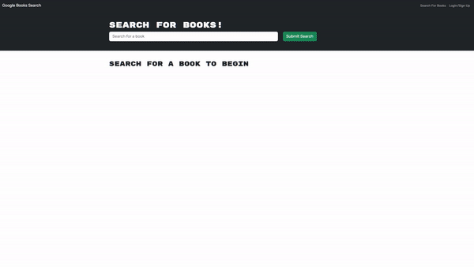

# 21-Book-Search-Engine
This is a repo created for the 21st challenge from the EdX bootcamp. This will be deployed on heroku.


## Description

This challenge consisted in refactoring a fully functioning Google Books API search engine built with a RESTful API, refactoring it to be a GraphQL API built with Apollo Server. The original app was built using the MERN stack, with a React front end, MongoDB database, and Node.js/Express.js server and API.

## Acceptance Criteria

- GIVEN a book search engine
- WHEN I load the search engine
- THEN I am presented with a menu with the options Search for Books and Login/Signup and an input field to search for books and a submit button
- WHEN I click on the Search for Books menu option
- THEN I am presented with an input field to search for books and a submit button
- WHEN I am not logged in and enter a search term in the input field and click the submit button
- THEN I am presented with several search results, each featuring a book’s title, author, description, image, and a link to that book on the Google Books site
- WHEN I click on the Login/Signup menu option
- THEN a modal appears on the screen with a toggle between the option to log in or sign up
- WHEN the toggle is set to Signup
- THEN I am presented with three inputs for a username, an email address, and a password, and a signup button
- WHEN the toggle is set to Login
- THEN I am presented with two inputs for an email address and a password and login button
- WHEN I enter a valid email address and create a password and click on the signup button
- THEN my user account is created and I am logged in to the site
- WHEN I enter my account’s email address and password and click on the login button
- THEN I the modal closes and I am logged in to the site
- WHEN I am logged in to the site
- THEN the menu options change to Search for Books, an option to see my saved books, and Logout
- WHEN I am logged in and enter a search term in the input field and click the submit button
- THEN I am presented with several search results, each featuring a book’s title, author, description, image, and a link to that book on the Google Books site and a button to save a book to my account
- WHEN I click on the Save button on a book
- THEN that book’s information is saved to my account
- WHEN I click on the option to see my saved books
- THEN I am presented with all of the books I have saved to my account, each featuring the book’s title, author, description, image, and a link to that book on the Google Books site and a button to remove a book from my account
- WHEN I click on the Remove button on a book
- THEN that book is deleted from my saved books list
- WHEN I click on the Logout button
- THEN I am logged out of the site and presented with a menu with the options Search for Books and Login/Signup and an input field to search for books and a submit button 

## Table of contents

- [Installation](#installation)
- [Mockup](#mockup)
- [Link](#link)
- [Credits](#credits)
- [License](#license)
- [Contributing](#contributing)
- [Tests](#tests)
- [Questions](#questions)

## Installation
Please use ```npm i``` to install the dependencies needed for this project (make sure you have Node.JS installed). Use ```npm start``` to run the server. or ```npm run develop``` tu run a developer build.


## Mockup
The website looks something like this:



Please clone this repo into your local and run NPM run develop to test functionality of this app while the deployment is fixed.

Currently working: 

- Search books
- login/signup form working
- save book working


## Link
Here is the link to the deployed application! (currently being debugged as the deployment failed!)  https://pure-sea-09227-08031f3f9006.herokuapp.com/ 

## Credits
The GrapghQL refactoring from this website was coded by me with support from a tutor. The mockup design, starting code for a restful API and acceptance criteria was provided by EdX & Tec de Monterrey.

## License
This project is licensed under the MIT license.

## Contributing
This repo is not open for contributions.

## Tests
N/A

## Questions
If you have any questions about the repo, open an issue or contact me directly at testemail@hotmail.com. You can find more of my work at [AlexTrejo92](https://github.com/AlexTrejo92).